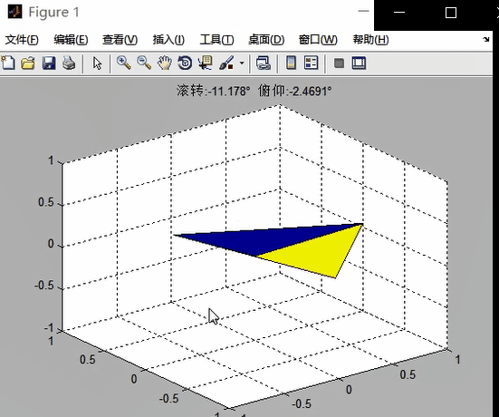

# Matlab_Attitude_Display_MPU6050

## 文件结构

|  文件名   | 描述  |
|  ---  | ---  |
|1.Attitude_cul_MPU6050|主程序，包含姿态解算与显示功能|
|2.Attitude_Display_PointMethod|独立显示程序，更改欧拉角可视化显示|
|3.RX、RY、RZ|三维显示所依赖的函数|


## 效果

### 1.Attitude_cul_MPU6050





### 2.Attitude_Display_PointMethod 程序效果：创建一个三角形，通过自动更改欧拉角缓慢转动它

通过更改注释来更改不同的维度：滚转phi、俯仰theta、偏航psi

``` matlab
phi = phi + pi/2/100;      %phi滚转缓增大
%theta = theta + pi/2/180;  %theta俯仰缓增
%psi = psi + pi/2/100;      %psi偏航缓增
```


此独立程序可以很方便地移植到其他matlab项目中
